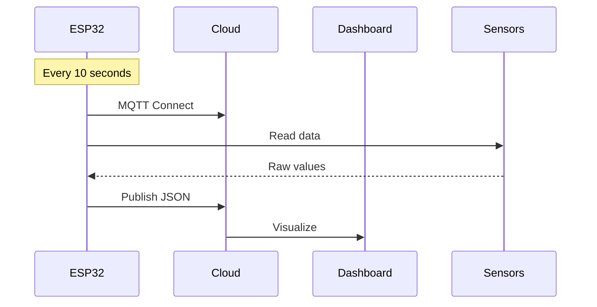

# 🌱 ESP32 Agricultural Monitoring System with Arduino IoT Cloud

<div align="center">
  
</div>

## 📋 Table of Contents
- [🌟 Key Features](#-key-features)
- [📦 Hardware Requirements](#-hardware-requirements)
- [🛠️ Setup Guide](#-setup-guide)
- [☁️ Arduino IoT Cloud Configuration](#️-arduino-iot-cloud-configuration)
- [🔄 Data Flow](#-data-flow)
- [⚠️ Troubleshooting](#-troubleshooting)
- [🤝 Contributing](#-contributing)
- [📜 License](#-license)
- [📊 Tutorial for Dashboard](#-tutorial-for-dashboard)

---

## 🌟 Key Features

| Feature                | Description                                           |
|------------------------|-------------------------------------------------------|
| **Multi-Sensor Monitoring** | Soil moisture, NPK values, temperature & humidity |
| **Cloud Integration**      | Real-time data via MQTT to Arduino IoT Cloud       |
| **Smart Calibration**      | Adjustable dry/wet values for soil sensor          |
| **Stable Connectivity**    | Auto WiFi reconnect handling                        |
| **Structured Data**        | Clean JSON-formatted payloads                      |

---

## 📦 Hardware Requirements

### 🔌 Essential Components
- **ESP32 DevKit** (Recommended: ESP32-WROOM-32)
- **Soil Moisture Sensor** (Capacitive preferred)
- **NPK Sensor** (JXCT-IoT model)
- **DHT22** (Temperature & Humidity sensor)
- **5V/2A Power Supply** (Battery backup recommended)

### 🧠 Wiring Guide

```
ESP32 Pin    →  Sensor
-----------------------------
GPIO34 (ADC) → Soil Moisture AO  
GPIO15       → DHT22 Data  
GPIO16 (RX2) → NPK Sensor TX  
GPIO17 (TX2) → NPK Sensor RX  
3.3V         → All Sensor VCC  
GND          → All Sensor GND  
```

---

## 🛠️ Setup Guide

### 1️⃣ Prerequisites
- [Arduino IoT Cloud](https://create.arduino.cc/iot/) account
- ESP-IDF v4.4+  
- Python 3.8+ (for optional dashboard scripts)

### 2️⃣ Firmware Setup

```bash
git clone https://github.com/yourusername/esp32-agri-monitor.git
cd esp32-agri-monitor

# Set WiFi credentials
sed -i 's/your_wifi/YOUR_WIFI_SSID/' main/main.c
sed -i 's/your_password/YOUR_WIFI_PASS/' main/main.c

# Build and flash firmware
idf.py set-target esp32
idf.py build
idf.py -p /dev/ttyUSB0 flash monitor
```

### 3️⃣ Sensor Calibration

Edit the following values in `main/main.c`:

```c
// For dry soil (air reading)
#define DRY_VALUE 3000

// For wet soil (fully saturated)
#define WET_VALUE 500
```

---

## ☁️ Arduino IoT Cloud Configuration

### 🧾 Create a Thing with These Variables:

```yaml
humidity: float       # Range: 0–100%
temperature: float    # Unit: °C
soilMoisture: int     # Range: 0–100%
nitrogen: int         # Unit: ppm
phosphorus: int       # Unit: ppm
potassium: int        # Unit: ppm
```

### 🖥️ Dashboard Setup
- Add **gauge widgets** for each sensor
- Add **time-series charts** for trends

---

## 🔄 Data Flow



---

## ⚠️ Troubleshooting

| Issue                  | Fix / Suggestion                           |
|------------------------|--------------------------------------------|
| No WiFi connection     | Double-check SSID & password, restart ESP32 |
| NPK sensor timeout     | Ensure correct UART pins & 9600 baud rate  |
| MQTT disconnects       | Re-check Thing ID, secret key, and tokens  |
| Noisy ADC readings     | Add a 0.1μF capacitor between VCC & GND    |

---

## 🤝 Contributing

We welcome all contributions, including:
- 🌿 Adding new sensors
- 🔋 Power consumption improvements
- 📈 Better data visualization

### How to Contribute:
1. Fork this repository  
2. Create your feature branch  
   ```bash
   git checkout -b feature/your-feature
   ```
3. Commit your changes and push  
4. Submit a Pull Request 🚀

---

## 📜 License

This project is licensed under the **MIT License**.  
See the [LICENSE](LICENSE) file for more details.

<div align="center">
   
  
</div>

---

## 📊 Tutorial for Dashboard

To run the dashboard using **Panel** and visualize your data, follow these steps:

### 1️⃣ Install Dependencies
Make sure you have **Python 3.8+** and **Panel** installed:

```bash
pip install panel
pip install pandas
```

### 2️⃣ Run the Dashboard
Once the dependencies are installed, navigate to the folder containing `dashboardv4.py`, and run the following command:

```bash
panel serve ./dashboardv4.py
```

This will start a local server, and you can access the dashboard in your browser by visiting the URL provided in the terminal (usually `http://localhost:5006`).

### 3️⃣ Customize Your Dashboard (Optional)
You can modify the `dashboardv4.py` to fit your specific needs by editing widgets, charts, and data connections.
```

